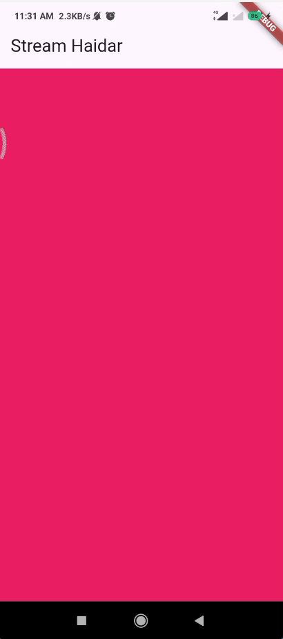

# **Pemrograman Mobile Pertemuan Minggu 12**

| Nama  :   | Haidar Aly |
| :--------: | :-------: |

| Kelas :  | TI-3F    |
| :--------: | :-------: |

| Absen : |  09  |
| :--------: | :-------: |

| NIM   :  | 2241720258   |
| :--------: | :-------: |

## Praktikum 1

### Soal 1 - Tambahkan nama panggilan Anda pada title app sebagai identitas hasil pekerjaan Anda. Gantilah warna tema aplikasi sesuai kesukaan Anda.

> ```dart
> class MyApp extends StatelessWidget {
>  const MyApp({super.key});
>
>  @override
>  Widget build(BuildContext context) {
>    return MaterialApp(
>      title: 'Stream Haidar',
>      theme: ThemeData(
>        primarySwatch: Colors.deepOrange,
>      ),
>      home: const StreamHomePage(),
>    );
>  }
> }
> ```

### Soal 2 - Tambahkan 5 warna lainnya sesuai keinginan Anda pada variabel colors tersebut.
> ```dart
> class ColorStream {
>   final List<Color> colors = [
>     Colors.blueGrey,
>     Colors.amber,
>     Colors.deepPurple,
>     Colors.lightBlue,
>     Colors.teal,
>     Colors.red,
>     Colors.cyan,
>     Colors.green,
>     Colors.black,
>     Colors.pink,
>   ];
> }
> ```

### Soal 3 - Jelaskan fungsi keyword yield* pada kode tersebut! Apa maksud isi perintah kode tersebut?
> Kode tersebut membuat stream yang menghasilkan nilai setiap satu detik. Nilai yang dihasilkan adalah warna dari daftar `colors` berdasarkan indeks yang dihitung dari waktu `t` modul panjang daftar `colors`. Dengan kata lain, setiap detik, stream akan mengeluarkan warna berikutnya dalam daftar secara berurutan.

### Soal 4 - Capture hasil praktikum Anda berupa GIF
> 

### Soal 5 - Jelaskan perbedaan menggunakan listen dan await for
> Listen digunakan untuk mendengarkan perubahan pada stream, sedangkan await for digunakan untuk menunggu nilai yang dihasilkan oleh stream. Jika stream tidak menghasilkan nilai, maka await for akan menunggu sampai stream menghasilkan nilai. Jika stream tidak menghasilkan nilai, maka listen akan terus mendengarkan perubahan pada stream.

## Praktikum 2

### Soal 6 - Jelaskan maksud kode langkah 8 dan 10 tersebut! dan Capture hasil praktikum Anda berupa GIF
> Proses penambahan kode tersebut adalah bagian dari sebuah aplikasi Flutter yang menggunakan Stream untuk mengelola data secara asinkron. Secara keseluruhan, kode ini menginisialisasi stream pada initState, mendengarkan perubahan pada stream, dan memperbarui state dengan nilai terbaru. Pada dispose, stream ditutup untuk membersihkan resource. Metode addRandomNumber digunakan untuk menambahkan angka acak ke dalam stream.
> 

### Soal 7 - Jelaskan maksud kode langkah 13 sampai 15 tersebut!
> Secara keseluruhan, kode ini menunjukkan bagaimana menangani event dan error pada stream di Dart, serta bagaimana memperbarui UI berdasarkan event atau error tersebut.
> 

## Praktikum 3

### Soal 8 - Jelaskan maksud kode langkah 1-3 tersebut! dan Capture hasil praktikum Anda berupa GIF
> Kode ini digunakan untuk memproses data dari stream, mengubah setiap nilai dengan mengalikannya dengan 10, dan menangani kesalahan dengan menetapkan nilai -1. Hasilnya kemudian digunakan untuk memperbarui state dalam aplikasi Flutter.
> 

## Praktikum 4

### Soal 9 - Jelaskan maksud kode langkah 2, 6 dan 8 tersebut! dan Capture hasil praktikum Anda berupa GIF dan lampirkan di README.
> Kode ini mengatur aliran untuk menangani nomor acak, mendengarkan nomor baru dan kesalahan, dan memperbarui UI yang sesuai. Kode ini juga memastikan pembersihan yang tepat dengan membatalkan langganan saat widget dibuang.
> 

## Praktikum 5

### Soal 10 - Jelaskan mengapa error itu bisa terjadi?
> Kesalahan terjadi karena percobaan listening streaming yang sama dengan beberapa listener. Di Dart, stream subscription tunggal hanya dapat memiliki satu listener aktif dalam satu waktu. Ketika mencoba menambahkan listener kedua, maka akan terjadi kesalahan.

### Soal 11 - Jelaskan mengapa hal itu bisa terjadi? dan Capture hasil praktikum Anda berupa GIF
> Menggunakan asBroadcastStream() memungkinkan stream Anda untuk mendukung banyak listener, itulah sebabnya kode berjalan normal ketika perubahan tersebut terjadi.
> 

## Praktikum 6

### Soal 12 - Jelaskan maksud kode pada langkah 3 dan 7! dan Capture hasil praktikum Anda berupa GIF
> kode diatas berguna untuk membuat stream dari banyak nomor random yang diupdate setiap detik.
> 

## Praktikum 7

### Soal 13 - Jelaskan maksud praktikum ini ! Dimanakah letak konsep pola BLoC-nya? dan Capture hasil praktikum Anda berupa GIF
> Pola BLoC (Business Logic Component) dalam kode Flutter praktikum ini diimplementasikan dalam kelas RandomNumberBloc, yang digunakan dalam widget RandomScreen.
> 